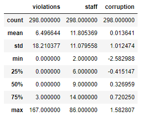

# An analysis of a Corruption x Traffic Violations dataset

## Abstract

This project involves analyzing a corruption dataset obtained from the Journal of Political Economy (v. 15, n. 6, p. 1020-1048, 2007) which contains information about traffic violations committed by diplomatic personnel working in New York. The aim is to explore the relationship between traffic violations, the number of staff members, and the corruption index of their respective countries. The dataset will be pre-processed to identify patterns and insights, and various statistical and machine learning techniques will be used to visualize the data.
Algorithms used: GLM - Poisson, Zero-Inflated Poisson, Negative Binomial and Zero-Inflated Negative Binomial.

## Methodology
Initially, a summary of the variables in the dataset will be extracted, and a histogram will be created to display the frequency of each event. According to the shape of the histogram, we will proceed with modelling. Each model will be compared briefly to determine the best fit for the observations.
Statistical analysis will be conducted to compare the mean and variance of the 'corruption' dataset. The results will be plotted against real-world data to make a comparison.
Finally, the different models will be compared by plotting violations against the number of staff members.
Overall, this project aims to identify the relationship between diplomatic immunity and traffic violations and the extent to which it varies across different countries.

## Development
First, let’s extract a summary of all the variables in the dataset.

Then, we will proceed creating a histogram reflecting the frequency that each single event has happened:

It is possible to see that our histogram won’t converge to a normal distribution. So, we will resort to Regression Models for Count Data, starting with the Poisson model, and then modelling the Negative Binomial, Zero-Inflated Poisson, and Zero-Inflated Negative Binomial. We will briefly compare each model to acknowledge which one is the most fit for our observations.

On a first analysis, we compared the mean and variance for the ‘corruption’ dataset:

We have also made a plot comparing what was observed in a real-world situation. 

As the mean is statistically different from the variance, we could start modelling straight to the negative binomial regression. However, for educational purposes, we will start with the Poisson regression.
Our first model came out as the following:

All the variables are statistically relevant to the model. After generating the model, we will test for overdispersion (Cameron & Trivedi, 1990).

This indicates that we have overdispersion of data, and we should proceed to modelling with the Poisson-Gama regression. Comparing both models, we can see that the Negative Binomial model is much more fit to the real-world data, increasing the LL from 2071.79 to -567.40.

As our histogram indicates a zero-inflated model, we will proceed and build Zero-Inflated Poisson and Zero-Inflated Negative Binomial models.

Between all the models, our best fit was the Zero-Inflated Binomial Negative, with a Log Likelihood of -557.264, close to the Binomial Negative.
Performing a likelihood ratio test, we can assure that the ZINB is statistically different from the Negative Binomial.
Now, let's compare the model with the real data.

Our model is decent at capturing the zeros from the real-data, and can also capture the tail of the histogram.
Making a plot between violations and number of staff members, we can compare all the models against each other. 

